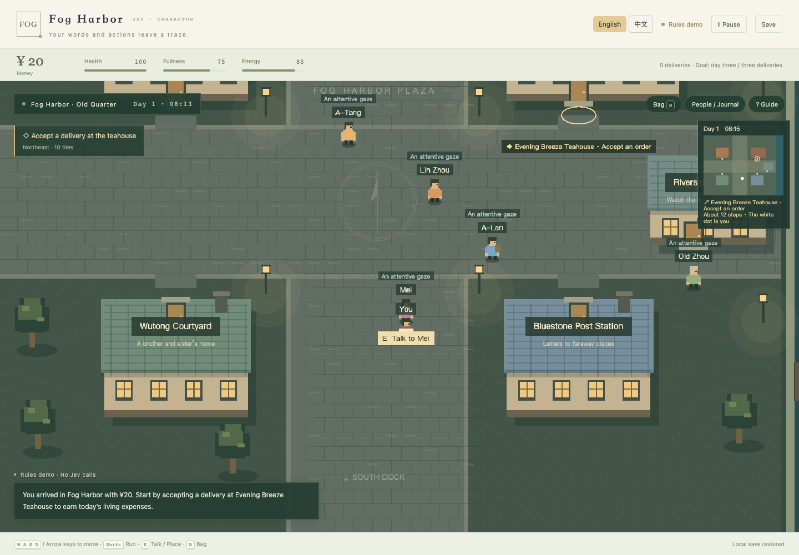
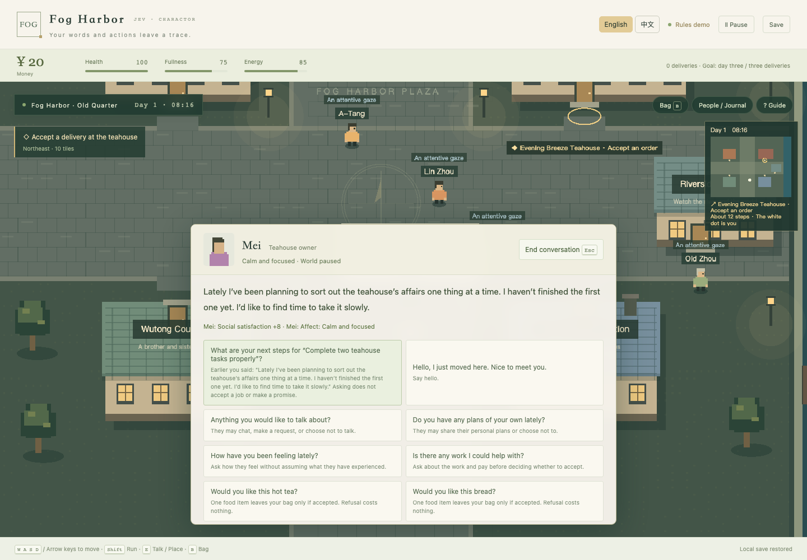
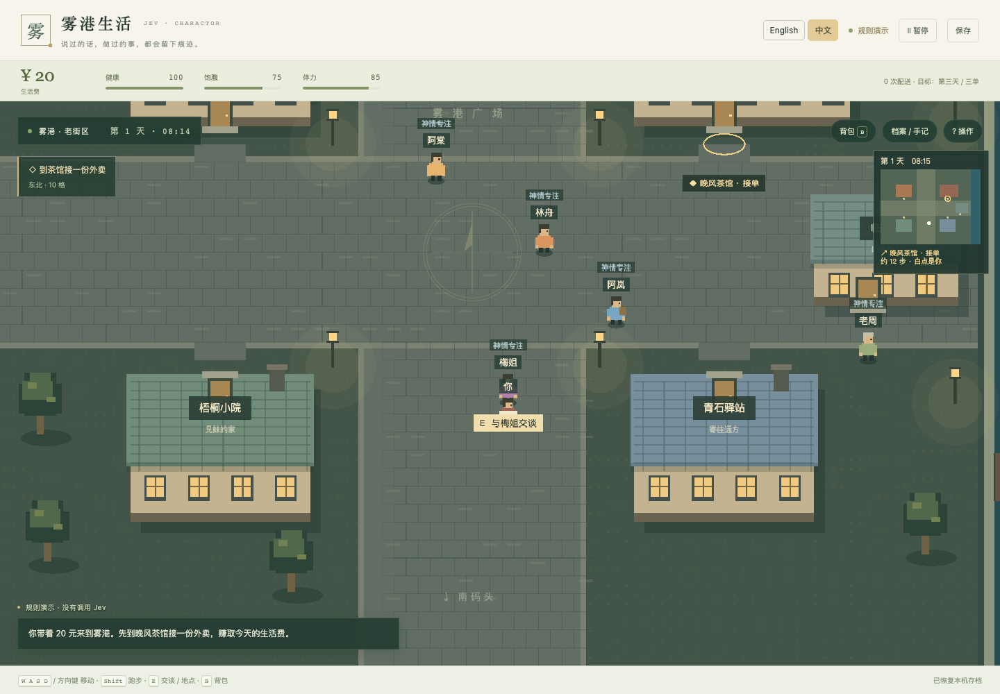

<div align="center">

# Jev-Character: Decision-Driven Role-Playing Agents with Memory and Programmatic Dialogue

### From one character to an AI town. Decisions become actions — and conversation.

Build NPCs that pursue their needs, remember encounters and respond to players — with a model that chooses instead of writing prose. **Jev-Character** is the independent core. **Fog Harbor** brings multiple characters together in a playable AI town.

**[中文](README.zh-CN.md)** · **[Architecture](#architecture)** · **[Project structure](#project-structure)** · **[Build your own application](#use-the-character-core-in-another-project)** · **[Play locally](#play-fog-harbor-locally)**

</div>

## Project abstract

**Jev-Character is a modular TypeScript framework for role-playing agents and autonomous game NPCs powered by the Jev decision model.** It combines agent memory, character knowledge, personal goals, bounded action selection and programmatic dialogue in a reusable character SDK. Developers describe character principles in natural language and supply changing observations and memories; Jev selects eligible actions and communicative intents, while the host executes world effects and composes responses from authored plans and permitted facts. This supports character–environment, character–character and player–character interaction without free-form text generation in the Jev dialogue path. Fog Harbor is a bilingual, playable 2D AI town and small multi-agent simulation demonstrating the approach. The project explores a path from individual characters toward agent societies; it is a software alpha, not evidence of large-scale social emergence or superiority over rule-based or LLM-based agents.

**Keywords:** role-playing agents · autonomous NPCs · game AI · agent memory · multi-agent simulation · AI town · programmatic dialogue · natural-language behavior authoring · Jev.



*Fog Harbor is the playable case study: five residents, a small neighborhood, and a player trying to make a living. Screenshots in this README use the explicitly labeled offline rules mode; they illustrate the interface, not evidence of Jev model quality.*

**An agent town begins with characters.** Give each resident its own knowledge, needs and memories, then let them act in a shared world, encounter one another and exchange information. Jev-Character starts at the individual level so that the same machinery can support a larger agent society. The current five-resident town demonstrates a small shared world; a rich, large-scale AI society is a direction to build toward.

**A decision-only model can still power player-facing conversation.** Jev selects what a character intends to do or communicate. The program layer combines that choice with permitted facts, current state, remembered encounters and authored phrasing to produce a readable response. Players can ask, follow up, offer help and see concrete consequences without the Jev path generating prose token by token. The goal is satisfying interaction within an authored world; today's version uses contextual player choices and finite expression content.

**Author decisions in words, let new experiences inform the next choice.** Our development takeaway is that natural-language principles and changing knowledge/memory can guide selection without a hand-written decision branch for each new situation. [What we learned](#what-we-learned-while-building-it) explains this authoring benefit and its boundaries.

## Why build this?

A game character needs more than a line of dialogue. It needs reasons to act, a view of the world, things it remembers, and consequences when it makes a choice.

Scripted NPCs offer reliable, author-controlled behavior. Generative LLM characters offer flexible language and contextual interpretation, but introduce inference overhead and another layer to reconcile with game state. We explore a useful design point between them: **let a model choose what a character means to do or say, then let the game execute and express that choice.**

[Jev](https://docs.typesafe.ai/introduction) is a structured decision model: it evaluates state and typed questions rather than generating free-form prose. Jev-Character builds the surrounding character system. The model is one replaceable decision provider; the world, memory, rules, dialogue composition and presentation remain explicit software.

These two ideas drive the project:

- **From autonomous characters to a shared society:** NPCs act on their needs and personal goals, interact with their environment, and invite one another to socialize. The town is a case study for a reusable character core.
- **Conversation through decisions and programs:** players interact with NPCs whose replies draw on their own knowledge, current state and shared experiences. Model-selected meaning, program-composed expression and game execution work together to support follow-ups and real consequences.

**Current status:** a local playable alpha. The first version uses contextual player choices. Free-text player input, unrestricted generated conversation and a complete friendship simulation are not implemented. The current priority is making the character loop and game work well; paper work is secondary.

## The design: decision → consequence → expression

Consider asking a resident whether they need help. The game checks what they have actually observed and which jobs remain. It constructs legal responses such as offering a particular job, handling it personally, or declining. Jev chooses among those responses in the context of that resident's needs, personality and experience.

If a job is offered and accepted, the engine reserves that exact task. Work must really finish before it pays. A promise has a deadline and can be fulfilled or broken. Later replies can refer to that recorded experience.

Dialogue uses the same principle:

1. **Collect permitted information.** Use the character's knowledge and relevant state, not every fact in the world.
2. **Build semantic response candidates.** Each candidate has an intent, available facts and authored expression parts. Candidates may include answering, following up, refusing or attending to a need.
3. **Select with Jev.** Choose an offered response/action and affect; there is no free-form dialogue completion in the game's Jev path.
4. **Validate and apply.** Reject stale or invalid choices and execute eligible effects once.
5. **Compose and present.** Render the chosen content with authored phrasing and display it in English or Chinese. Record completed exchanges for later context.

The author supplies the vocabulary of actions and expression; the model interprets the situation within that vocabulary. Saying “I'll help” does not itself complete a task. Mentioning a goal does not advance it. A character does not learn a secret merely because it exists in the world.

## Architecture

**Jev-Character is the reusable core; Jev is its decision backend; Fog Harbor is one host application.** You can use the core without the town, its renderer or its delivery mechanics. The independently installable package is `@jev-character/core`.

The diagram groups responsibilities and integration contracts. Arrows show how the host connects the pieces, rather than implying that every core component runs automatically.

```mermaid
flowchart LR
    subgraph APPS["1 · Applications"]
        A["Fog Harbor · text-only cabin<br/>Extend to companions, stories and simulations"]
    end
    subgraph HOST["2 · Host integration"]
        E["World rules, time and persistence<br/>CharacterEnvironment adapter<br/>Legal actions, observations and authored content"]
    end
    subgraph CORE["3 · Jev-Character · reusable core SDK"]
        direction TB
        M["Character state<br/>Persona, knowledge and memory<br/>Goals, feelings and commitments"]
        R["CharacterRuntime<br/>Context and interaction contracts<br/>Validation, concurrency and cancellation"]
        S["Dialogue and expression<br/>Spoken history and open topics<br/>Fact-backed response composition"]
    end
    subgraph MODELS["4 · Decision backends"]
        P["DecisionProvider adapter<br/>Jev · explicit rules · other models"]
    end
    APPS --- HOST
    HOST <-->|"Observe · act · remember · express"| CORE
    CORE <-->|"Context + options / choice + affect"| MODELS
    style CORE fill:#eaf4ff,stroke:#2563eb,stroke-width:3px,color:#102a43
```



The core is a cohesive set of character state, dialogue and execution contracts. Its programmed parts preserve continuity and make decisions executable. **Jev supplies context-sensitive selection within the host's legal action and response space.** It does not replace the world simulator or generate the dialogue text.

| Boundary | Reusable capability / application responsibility | Location |
| --- | --- | --- |
| Core: character continuity | Persona, bounded memory, evidence-backed knowledge, personal goals/feelings, commitments and spoken-turn history | [`src/character`](src/character/README.md) |
| Core: decisions and interaction | Context projection, drive/forecast types, interaction contracts, turn orchestration and validated decisions | [`Public API`](src/character/api.ts) |
| Core: expression | Compile authored plans against permitted, current facts; return text and evidence references | [`response.ts`](src/character/response.ts) |
| Host adapter | Decide what is observable and eligible; execute effects and update the character using core APIs | [`Fog Harbor adapter`](src/adapters/fog-harbor), [`cabin`](examples/cabin.ts) |
| Decision backend | Network transport, credentials, timeout and selection policy | [`LocalJevProvider`](src/providers/local-jev.ts), [`server/jev.ts`](server/jev.ts) |
| Game content and presentation | Need decay, jobs, deliveries, social encounters, concrete speech content, map and bilingual UI | [`src/sim`](src/sim), [`src/game.ts`](src/game.ts), [`src/main.ts`](src/main.ts) |

The core does not import Phaser, town coordinates or delivery rules. It provides native ESM and TypeScript declarations; its only runtime dependency is Zod. The host chooses which capabilities to use and explicitly records observations and outcomes. `CharacterRuntime.step()` does not automatically update every ledger, create a schedule or generate an action vocabulary. The Jev network adapter is included in this repository, but is not yet bundled into the core SDK.

## Project structure

```text
jev-charactor/
├── src/character/           Reusable core implementation
│   ├── api.ts              Public API exported by the SDK
│   ├── index.ts            Persona, experiences, commitments and intents
│   ├── knowledge.ts        Evidence and belief views
│   ├── personal.ts         Goals, preferences and event feelings
│   ├── dialogue.ts         Spoken turns and open topics
│   ├── response.ts         Fact-backed response composition
│   ├── motivation.ts       Drives, forecasts and utility baseline
│   ├── interaction.ts      Player interaction contracts
│   └── runtime.ts          Environment/provider ports and turn lifecycle
├── packages/core/          SDK packaging, declarations and standalone quickstart
├── src/providers/          Browser-to-local-server Jev transport
├── server/                 Local API and server-side model integration
├── src/adapters/fog-harbor/ Town adapter and decision scheduling
├── src/sim/                Town-specific mechanics and authored content
├── src/game.ts             Phaser world presentation
├── src/main.ts             Game UI and application wiring
├── src/i18n/               English/Chinese presentation
├── examples/cabin.ts       Second host environment, without town or renderer
├── scripts/character-lab.ts Runnable cabin integration, rules or real Jev
├── tests/                  Core, adapter and game regression tests
├── scripts/                Build, browser, SDK and evaluation tooling
└── docs/                   Design, playtest and development documentation
```

`packages/core` packages the implementation in `src/character`; it is not a second copy of the core. Start with the [SDK quickstart](packages/core/README.md) to consume it, or the [public API](src/character/api.ts) to extend its shared capabilities. The town is a reference integration, not a required dependency.

## What is different from a programmed NPC?

**The intended advantage is a more flexible way to author contextual choices.** A developer can describe a personality, a situation and the meaning of available actions in natural language instead of writing a separate decision branch for every combination. More textual context can inform selection without adding an equivalent number of explicit conditions.

That does not remove programming. Someone still defines legal actions, disclosure rules, state changes and expression plans. A carefully written rule system may be the better solution for a small, predictable scenario.

| | Program / utility NPC | Jev + character system | Generative LLM character |
| --- | --- | --- | --- |
| Decision authoring | Conditions, priorities or utility weights | Descriptions of roles, context and legal choices | Prompted policy and/or tool use |
| Input handling | Features the author explicitly models | Structured state plus textual context | Textual context, often with structured tools |
| Player-facing speech | Authored lines or composed templates | Selected semantic content + composed templates | Generated prose, possibly constrained |
| World changes | Game rules | Game rules | Requires a game execution/validation boundary too |
| Practical tradeoff | Fast, predictable; rule coverage needs maintenance | Flexible selection; network latency and authored content remain | Broad expression; inference and grounding need management |

These are architectural tradeoffs, **not a claim that Jev has already beaten rules or LLMs**. Our small development comparisons have not established a general quality or latency advantage, and the proposed authoring-effort benefit has not been measured. The portable interfaces make those comparisons possible without changing the world executor.

## What we learned while building it

**Our biggest development takeaway: character decision logic can be authored in natural language.** Instead of adding another conditional branch for every combination of personality, needs and past encounters, we can describe a character's priorities and the available actions, then ask Jev to choose in the current situation. In our development experience, this made experimenting with character behavior more convenient.

The benefit extends beyond the initial character description. A resident may learn something new, hear a conflicting report or remember a broken promise. Once the host records that information and includes it in the decision context, **we do not need a separate decision branch for each new fact or memory**. Jev can interpret the changed context using the existing options and character instructions.

For example, with the same `help`, `work` and `rest` candidates, an author can describe “protect your energy when exhausted” or “honor an accepted obligation before optional work.” The host supplies current energy and recorded obligations; the author need not enumerate every possible sentence in the character's history as a new rule. This is an illustration of the authoring interface, not a guarantee of the model's choice.

The work shifts toward defining meaningful actions, clear character principles and relevant observations. Programs still determine which information is accessible, which actions are legal, and what those actions actually change. Adding a new ability requires an executor; adding knowledge or revising a priority within an existing action space does not inherently require another hand-written decision branch. This is our qualitative development experience, not a measured productivity result or a claim that Jev always reasons correctly.

## Fog Harbor: a small town you can live in

Start with 20 coins. Earn money, buy food, take a break and get to know five residents. The opening objective is to reach day three and complete three deliveries; you can keep playing afterward.



*Conversation happens inside the game. The world pauses while you talk, but the selected resident can still answer.*

| System | What you can do or observe |
| --- | --- |
| Player survival | Watch fullness, energy and health; buy and eat food, rest or pay for lodging |
| Earning a living | Pick up and deliver meals, do timed shifts, or help with a resident's concrete task |
| Consequences | Delivery condition affects settlement; unfinished work does not pay; promises and broken promises are recorded |
| NPC autonomy | Residents choose eating, resting, work, hobbies, movement and social invitations from eligible activities |
| NPC social interaction | The recipient can accept, decline or defer; completed exchanges affect social satisfaction and share limited public news |
| Character knowledge | Public background, personal observations and heard reports retain provenance; world facts are not automatically shared |
| Contextual dialogue | Options depend on accessible facts, possessions, tasks and past exchanges; some topics support follow-ups and returning after a topic change |
| Language | English is the initial default; choose English or 中文 at startup. Display language does not rewrite simulation state or saves |

Localization is authored locally and makes no translation API calls. It changes display only: both languages use the same canonical world, saves and Jev decision inputs. New authored content can extend the [localization catalog](src/i18n); unrecognized text remains as written.

**A good first session:** find the teahouse, accept a delivery, wait for pickup, and bring it to the correct resident. Buy food, then open your bag to eat it. Ask a resident about their plans or available work, complete something together, and return to the conversation. End the conversation after accepting timed work: its clock starts moving again when you return to exploration.

| Control | Action |
| --- | --- |
| WASD / arrow keys / click ground | Move |
| Shift | Run |
| E | Interact with a nearby person or place |
| B | Open your bag |
| Esc | Close the current panel / end conversation |
| Journal / character drawer | Inspect memories, needs and recorded decisions |



This is a compact authored simulation, not the full depth of The Sims, RimWorld or Dwarf Fortress. NPC food supply is abstracted; it is not a complete economy. Long-term NPC friendship networks, household systems and open-ended language generation remain outside the current game. Dialogue coverage is finite, and repetition is still a practical limitation.

## Play Fog Harbor locally

Requires **Node.js 22.12+**, npm, and a desktop browser. The commands below target macOS/Linux. This is a local client/server app, not a static GitHub Pages site.

```sh
git clone https://github.com/YichenBC/jev-charactor.git
cd jev-charactor
npm ci
npm run build
npm start
```

Open **http://127.0.0.1:4317/**. Choose your language before starting.

### Try without an API key

The game can run using its explicit **rules demo** mode. Choose **People / Journal → Records → Use rules demo**. The connection badge identifies the provider. This uses the same world and expression system but does not demonstrate Jev decisions.

### Enable real Jev decisions

Copy the example environment file if you do not already have a local `.env`:

```sh
cp .env.example .env
```

Set these values in `.env`, then restart the server:

```dotenv
OPENROUTER_API_KEY=your_key_here
JEV_MODEL=typesafe/jev-1.13
PORT=4317
```

The key stays on the local server; do not put it in browser code or commit it. The current integration uses OpenRouter. Availability and billing depend on your account and configured model. The additional `EVAL_*` settings are only for research tooling and are unnecessary for playing.

Switch to real Jev in the decision-records panel if rules mode is active. The interface reports connection failures; check the badge and records before attributing a decision to Jev. **A running world can make paid decisions even when you are not talking.** Pause the game when you stop playing. The local server currently bounds concurrency to two and requests to 1,200 per server session; this is not a dollar budget.

For development, use `npm run dev`. On macOS, [`启动雾港.command`](启动雾港.command) is a convenience launcher. Saves live in your browser's local storage for the app's origin; another browser or port has a separate save. The language preference is stored separately.

The server binds to loopback and enforces local Host/Origin checks. Internet hosting with authentication and multi-user saves is not configured by this project.

## Use the character core in another project

You can build a new host around the same core: for example, a spaceship companion with fatigue and obligations, a text adventure with private knowledge, or a training role that remembers prior interactions. These are extension ideas; the implemented hosts are Fog Harbor and the cabin.

### 1. Run the independent example and install the SDK

```sh
npm run lab:characters          # Deterministic text-only integration example; no API call
npm run test:core-package       # Pack, install in a temporary consumer, run and type-check
npm run pack:core               # Build the local SDK tarball
```

In your own Node ESM project, install the generated archive, replacing the absolute path with your checkout:

```sh
npm install /absolute/path/to/jev-charactor/artifacts/core/jev-character-core-0.1.0-alpha.5.tgz
```

Import from `@jev-character/core`, not its internal module paths. The [standalone SDK example](packages/core/README.md#run-a-complete-example) runs with plain Node and demonstrates both knowledge and an actual state change.

### 2. Define characters and connect your world

Create a `CharacterMind` with `createMind`. Give each character a role, traits, values and speaking style. Add only accessible knowledge with `learnKnowledge`; record real events with `rememberExperience`. Your world owns meters such as hunger or fatigue and maps them to observations and, optionally, core `Drive` / `ActionForecast` data.

Implement `CharacterEnvironment.openTurn(characterId)`. Each turn supplies three things:

| Member | Your implementation |
| --- | --- |
| `input` | Character ID, revision, `buildDecisionContext(mind, situation, now)` and legal `{ id, label, description }` options |
| `isCurrent()` | Check world identity, relevant revisions, eligibility and pause state after an asynchronous decision |
| `execute(decision, source)` | Revalidate and atomically apply an eligible action, record actual consequences, then return `ExecutionResult` |

Return `null` when no turn should begin. Keep hidden world facts out of both context **and candidate descriptions**. Long actions start through `execute`; your simulation advances and completes them later. The [cabin adapter](examples/cabin.ts) shows these boundaries without a game engine; the [town adapter](src/adapters/fog-harbor/environment.ts) shows a larger integration.

### 3. Plug in Jev and schedule turns

Implement `DecisionProvider.decide(frame, signal)` to return a selected `choice` and `affect`. Wire the ports with `new CharacterRuntime(environment, provider, { maxConcurrent: 2 })`, then call `runtime.step(characterId)` when the character is eligible. Your host controls frequency and handles provider errors; the runtime does not silently switch policies. Use `runtime.cancel()` when unloading or replacing a world.

For a real Jev integration, follow the Node provider in [`scripts/character-lab.ts`](scripts/character-lab.ts), which uses [`server/jev.ts`](server/jev.ts). For browser clients, [`LocalJevProvider`](src/providers/local-jev.ts) forwards requests to a key-holding server. These are repository adapters to reuse/adapt, not exports of `@jev-character/core`; the supplied Jev endpoint supports 2–40 options and character IDs up to 40 characters, narrower than the core contracts.

After configuring the server-side `.env`, this optional command runs five real model decisions in the independent cabin and can incur API charges:

```sh
npm run lab:characters -- --jev
```

### 4. Add grounded conversation

Author `ResponsePlan` entries and `SpeechFact` records describing what this character may say. `compileResponses(plans, facts, now)` returns text/evidence candidates and excludes plans whose facts are missing, private or expired. Offer their IDs and semantic descriptions to the decision provider. Before presenting the selected candidate, recheck the turn and current facts; talking must not implicitly execute a promised action.

Record completed exchanges with `recordDialogueExchange`; use `openDialogueTopics` to build follow-up choices from actual retained turns. Your host supplies topic semantics, wording, disclosure policy and gameplay effects. The core supplies reusable composition and history operations. See the [SDK speech example](packages/core/README.md#compose-speech-without-generating-tokens) and [town dialogue implementation](src/sim/dialogue.ts).

### 5. Extend at the appropriate boundary

| You want to change… | Start here |
| --- | --- |
| A character's priorities or personality | Profile and natural-language context; existing legal actions can remain unchanged |
| What characters can do in your application | Host action candidates, execution rules and observed outcome recording |
| How they speak or what can be disclosed | Host speech plans/facts and topic rules, using the core composer and dialogue ledger |
| The decision model | A `DecisionProvider`; keep the same environment/executor for comparisons |
| A reusable memory, knowledge or lifecycle capability | `src/character` plus core tests; expose it through `api.ts` |
| Rendering, controls, language or save storage | Host presentation and persistence; keep them outside the core |

Validate hidden-information boundaries, stale decisions, once-only effects and memory of completed actions before adding more content. Run the deterministic host first, then inspect real Jev choices and their consequences. A new application should not need to import `src/sim` or modify the core just to define its own world.

The SDK is a source-available alpha, not a published npm package. The current repository has not yet adopted an open-source license; local packaging does not grant redistribution rights.

## Development and checks

```sh
npm test
npm run build
npx playwright install chromium
npm run test:browser:isolated
npm run test:survival
npm run test:core-package
```

The isolated browser check starts its own server and uses a disposable save and labeled fixtures. It does not call Jev or touch your ongoing game. Engineering tests check mechanisms and regressions; they do not establish subjective character quality.

- [Character core](src/character/README.md) — state, architecture and integration contracts.
- [SDK quickstart](packages/core/README.md) — standalone installation and examples.
- [Public distribution](docs/public-distribution.md) — source scope, licensing status and no-key reproduction.
- [Playtest guide](docs/playtest-guide.md) — a short, practical feedback session.
- [Evaluation guide](docs/evaluation-guide.md) — optional research tooling, separate from playing.

## References and project status

[Jev / TypeSafe](https://docs.typesafe.ai/introduction) provides the underlying structured decision model. [Jev Lab](https://github.com/jammaru/jev-lab) demonstrates model-selected actions in rule-governed games. [SillyTavern](https://github.com/SillyTavern/SillyTavern) informed our thinking about organizing character and conversation context. Life-simulation games inspired the needs/activity loop. These are references, not claims of feature parity or affiliation.

The map and characters are drawn by this project's Phaser code. Screenshot provenance is recorded [alongside the images](docs/images/README.md); dependency information is in [THIRD_PARTY_NOTICES.md](THIRD_PARTY_NOTICES.md). Model weights are not included.

This public repository is a clean source snapshot of the playable alpha and SDK. The project license remains undecided. Original private research evidence and development history are preserved separately and are not distributed here; see [distribution scope](docs/public-distribution.md).

## Citation

To reference this software, use the versioned entry below or download [`CITATION.bib`](CITATION.bib). It cites the released alpha, not a peer-reviewed paper. Author metadata is pending confirmation and is omitted from this entry.

```bibtex
@misc{jevcharacter2026,
  title = {{Jev-Character}: Decision-Driven Role-Playing Agents with Memory and Programmatic Dialogue},
  year = {2026},
  howpublished = {GitHub software release},
  url = {https://github.com/YichenBC/jev-charactor/releases/tag/v0.11.0-alpha.1},
  note = {Version v0.11.0-alpha.1; core SDK 0.1.0-alpha.5}
}
```
