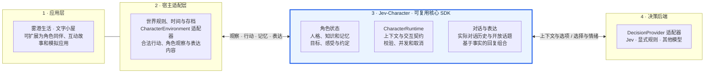

<div align="center">

# Jev-Character: Decision-Driven Role-Playing Agents with Memory and Programmatic Dialogue

### 从一个角色，到一座 AI 小镇。让决策成为行动，也成为对话。

让 NPC 为自己的需求行动、记住相遇、回应玩家——背后的模型负责选择，而不生成长篇文本。**Jev-Character 是独立的角色核心；雾港生活让多个角色相遇，组成一座可玩的 AI 小镇。**

**[English](README.md)** · **[设计架构](#设计架构)** · **[项目结构](#项目结构)** · **[基于核心开发](#把核心接到其他项目)** · **[本地启动](#本地启动)**

</div>

## 项目摘要

**Jev-Character 是一个基于 Jev 决策模型的模块化 TypeScript 框架，用于角色扮演智能体（role-playing agents）和自主游戏 NPC（autonomous NPCs）。** 它把智能体记忆、角色知识、个人目标、有界行动选择和程序化对话组织成可复用的角色 SDK。开发者用自然语言描述角色原则，持续提供变化的观察和记忆；Jev 选择合法行动与表达意图，宿主执行世界后果，并根据表达计划和获准事实组织回复。因此，角色可以与环境、其他角色及玩家互动，而 Jev 对话路径无需自由生成文本。雾港生活是展示这种方式的双语 2D AI 小镇与小型多智能体模拟。项目探索从单个角色扩展到 agent 社会的路径；当前为软件 alpha，不代表已验证大规模社会涌现，也不宣称优于规则或 LLM 智能体。

**关键词：** 角色扮演智能体（role-playing agents）· 自主 NPC · 游戏 AI · 智能体记忆（agent memory）· 多智能体模拟（multi-agent simulation）· AI 小镇 · 程序化对话（programmatic dialogue）· 自然语言行为编写 · Jev。


*雾港生活是核心框架的可玩案例：五位居民、一片小街区，以及需要维持生活的玩家。本文截图使用明确标注的离线规则模式，展示界面与玩法，不作为 Jev 模型效果的证据。*

**Agent 小镇，首先需要真正可交互的角色。** 每个居民拥有自己的知识、需求和记忆，在共享世界里行动、相遇和交换信息。Jev-Character 从单个角色能力出发，让同一套核心可以扩展到多个角色共同生活的 agent 社会，也就是 AI 社会。目前的五居民小镇展示了一个小型共享世界；丰富、大规模的 AI 社会是继续扩展的方向。

**只有决策能力的模型，也能支撑面向玩家的对话。** Jev 选择角色想做什么、想表达什么，程序层再结合获准披露的事实、当前状态、记忆和作者编写的表达，组织出玩家能读懂的回复。玩家可以询问、追问、提出帮助，并看到真实后果，而不需要 Jev 逐 token 生成台词。我们希望在作者定义的世界里满足玩家的交互需求；当前版本使用情境选项，表达内容仍有明确边界。

**用自然语言写决策，让新经历参与下一次选择。** 我们的开发体会是：角色原则以及不断变化的知识、记忆，可以直接参与模型判断，不必为每一种新情况手写决策分支。见[开发体会](#开发体会用自然语言编写角色决策)，了解这种便利及其边界。

## 背景：角色需要的不只是台词

游戏里的角色应该有自己的需求、掌握的信息、记住的经历，以及作出选择后的实际后果。

纯程序 NPC 容易控制、行为可靠；生成式 LLM 角色能理解丰富上下文、自由表达，但需要推理调用，也需要把语言与游戏状态对齐。我们希望探索中间的一种方案：**让模型判断角色想做什么、想表达什么，再由游戏执行并组织语言。**

[Jev](https://docs.typesafe.ai/introduction) 面向结构化决策：根据状态回答有类型的问题，而不是自由生成文章。Jev-Character 搭建围绕这个决策器的角色系统。世界、记忆、动作规则和表达接口由程序维护，Jev 只是可以替换的决策提供器。

这两个想法构成项目的主线：

- **从自主角色到共同生活的社会：** NPC 根据需求和个人目标安排活动，与环境互动，也会邀请其他 NPC 社交。小镇是可复用角色核心的案例。
- **通过决策与程序形成对话：** NPC 结合自己知道的事、当下状态和共同经历回应玩家。模型选择语义，程序组织表达，游戏执行后果，共同支撑追问和真实交互。

目前是**本地可玩 alpha**。玩家使用动态情境选项，尚无自由文本输入、无限开放对话或完整好友关系网络。当前优先打磨核心与小游戏，论文后置。

## 设计思路：决策、后果、表达

比如玩家问梅姐有没有需要帮忙的工作。系统先检查她实际知道哪些待办、哪些工作仍未完成，再提供“邀请玩家做具体工作”“自己处理”“暂时拒绝”等合法回应。Jev 根据她的性格、需求、经历和当前情境作选择。

若双方同意，执行器预留那一件工作；必须真正做完才有报酬。约定有截止时间，可能履行，也可能失约。之后聊天可以引用这次经历。

对话也沿着同一条路径：

1. **收集角色可说的信息：** 使用自己的知识和相关状态，避免把世界全知信息塞给所有 NPC。
2. **构建语义候选：** 每个回应由意图、可用事实和作者编写的表达片段组成；可选回答、追问、拒绝或先照顾自己。
3. **由 Jev 选择：** 选择候选动作/回应及情绪，游戏的 Jev 路径不调用自由文本生成。
4. **校验并执行：** 拒绝过期或非法选择，符合条件的后果只结算一次。
5. **组织语言并展示：** 把选中的内容和表达计划组合为台词，再以中文或英文显示；完成的问答写入记录。

作者定义角色能做什么、有哪些表达资源，模型在这个空间中理解情境并选择。说“我会帮忙”不等于已经做完工作；谈起目标不会自动增加进度；秘密存在于世界中，不等于所有角色都知道。

## 设计架构

**Jev-Character 是可复用的角色核心，Jev 是决策后端，雾港生活是一个宿主应用。** 不使用小镇、地图和外卖机制，也可以独立接入这个核心；可安装的 SDK 名称为 `@jev-character/core`。

下图按职责和接入接口划分大板块。箭头表示宿主如何连接这些组件，不表示核心内部会自动执行所有步骤。



核心把角色状态、对话和执行接口组织成一套可复用模块。其中的程序负责保留角色连续性、让行动产生真实效果；**Jev 负责在宿主提供的合法行动与回复空间里，结合上下文作出选择。** 它不承担世界模拟，也不生成回复文本。

| 边界 | 可复用能力 / 应用责任 | 代码 |
| --- | --- | --- |
| 核心：角色连续性 | 人格、有界记忆、带来源的知识、个人目标与感受、约定和实际对话历史 | [`src/character`](src/character/README.md) |
| 核心：决策与交互 | 上下文投影、需求及行动预测类型、交互契约、回合管理与决策校验 | [公共 API](src/character/api.ts) |
| 核心：表达 | 根据获准且当前有效的事实组合表达计划，返回文本及依据 | [`response.ts`](src/character/response.ts) |
| 宿主适配器 | 判断可见信息及合法行动，执行后果，调用核心 API 更新角色 | [雾港适配器](src/adapters/fog-harbor)、[文字小屋](examples/cabin.ts) |
| 决策后端 | 网络传输、凭证、超时和选择策略 | [`LocalJevProvider`](src/providers/local-jev.ts)、[`server/jev.ts`](server/jev.ts) |
| 游戏内容与表现 | 需求衰减、工作、外卖、社交事件、具体表达内容、地图和双语界面 | [`src/sim`](src/sim)、[`src/game.ts`](src/game.ts)、[`src/main.ts`](src/main.ts) |

核心不依赖 Phaser、雾港坐标或外卖规则，提供原生 ESM 和 TypeScript 声明，唯一运行时依赖是 Zod。宿主按需组合能力，显式记录观察和结果。`CharacterRuntime.step()` 不会自动更新所有角色记录、生成日程或创造行动词表。仓库中有 Jev 网络适配器，但目前尚未打包进核心 SDK。

## 项目结构

```text
jev-charactor/
├── src/character/           可复用核心的实现
│   ├── api.ts              SDK 导出的公共 API
│   ├── index.ts            人格、经历、约定和意图
│   ├── knowledge.ts        知识证据及信念视图
│   ├── personal.ts         目标、偏好和事件感受
│   ├── dialogue.ts         实际对话与开放话题
│   ├── response.ts         基于事实的回复组合
│   ├── motivation.ts       需求、行动预测和效用基线
│   ├── interaction.ts      玩家交互契约
│   └── runtime.ts          环境/决策器接口与回合生命周期
├── packages/core/          SDK 打包、类型声明和独立接入示例
├── src/providers/          浏览器到本地服务的 Jev 通信
├── server/                 本地 API 与服务端模型接入
├── src/adapters/fog-harbor/ 小镇适配器与决策调度
├── src/sim/                小镇专属机制及作者编写的内容
├── src/game.ts             Phaser 世界展示
├── src/main.ts             游戏 UI 与应用组装
├── src/i18n/               中英文展示
├── examples/cabin.ts       第二个宿主环境，不依赖小镇或渲染器
├── scripts/character-lab.ts 可运行的小屋示例，支持规则或真实 Jev
├── tests/                  核心、适配器和游戏回归测试
├── scripts/                构建、浏览器、SDK 和评测工具
└── docs/                   设计、试玩和研发文档
```

`packages/core` 打包的是 `src/character` 中的实现，没有维护第二份核心。接入时从 [SDK 快速开始](packages/core/README.md)读起；扩展通用能力时从[公共 API](src/character/api.ts)读起。小镇是接入范例，不是必需依赖。

## 与纯程序角色相比，优势在哪？

**我们希望降低的是“根据丰富情境编写决策”的负担。** 开发者用自然语言描述性格、当前情况和候选行为的含义，让模型综合判断，减少为每一种组合单独编写条件分支的需要。角色决策可以接收更丰富的文本上下文。

这不代表不需要程序。动作是否合法、信息能否透露、行为产生什么后果、有哪些表达资源，仍由开发者定义。对于简单、稳定的场景，精心编写的规则可能更合适。

| | 纯程序 / 效用 AI | Jev + 角色系统 | 生成式 LLM 角色 |
| --- | --- | --- | --- |
| 决策编写 | 条件、优先级、权重 | 人格、情境与合法选项的描述 | 提示词策略和/或工具使用 |
| 输入 | 作者明确建模的特征 | 结构化状态及文本上下文 | 文本上下文，可结合结构化工具 |
| 台词 | 预写或组合表达 | 选择语义内容，再组合表达 | 生成文字，也可施加限制 |
| 世界变化 | 游戏规则 | 游戏规则 | 同样需要游戏执行与校验边界 |
| 取舍 | 快、确定；维护规则覆盖 | 决策灵活；仍有网络等待和内容编写 | 表达开放；需处理推理开销与事实一致性 |

这是设计上的取舍，**不是已经证明 Jev 比规则或 LLM 更好的结论**。目前的小规模开发对照没有建立普遍的质量或速度优势，作者是否更省时也尚未测量。统一接口让我们能够在相同世界执行器上比较不同决策器。

## 开发体会：用自然语言编写角色决策

**开发过程中，我们最大的感受是：虚拟人物的决策逻辑，可以用自然语言来描述。** 过去可能要为性格、需求和经历的各种组合不断补充条件分支；使用 Jev 后，可以描述角色的原则、当前情况和行动含义，让它据此选择。对我们而言，这让角色行为的尝试和调整更方便。

这个便利不只发生在初次定义角色时。角色可能获得新知识、听到相互矛盾的消息，也可能记住一次失约。宿主把这些信息记录下来并放入决策上下文之后，**不必再为每一条新知识、每一段新记忆单独编写决策分支**。Jev 可以根据变化后的上下文，在已有选项中重新判断。

例如，同样提供 `help`、`work`、`rest` 三个候选，可以用自然语言描述“精疲力尽时先照顾自己”，也可以描述“已经答应的事优先于可推迟的工作”。宿主提供当前精力和真实约定，作者不必把角色历史中可能出现的每句话都翻译成一条新的规则。这里说明的是编写方式，不保证模型一定作出某个选择。

因此，开发重心转向了定义有意义的行动、清楚的角色原则和相关观察。程序仍负责信息是否可见、动作是否合法、执行后究竟改变什么。新增一种能力需要实现执行器；在已有行动空间里增加知识或调整原则，则不必天然对应一条新的手写决策分支。这是我们的定性开发体会，尚不是经过测量的效率结论，也不代表 Jev 总能判断正确。

## 雾港生活：可以进去生活的小镇

你带着 20 元来到雾港。挣钱、买饭、休息、认识街坊。初始目标是活到第三天并完成三次配送，达成后可以继续玩。


*交谈直接出现在游戏画面里。对话期间世界暂停，当前人物仍可以回应。*

| 系统 | 可玩的内容 |
| --- | --- |
| 玩家生存 | 关注饱腹、体力、健康，购买并吃用食物，休息或付费住宿 |
| 收入 | 取餐送餐、计时短工、帮助居民处理具体待办 |
| 行动后果 | 配送状态影响结算；未完成不发工资；履约与失约留下记录 |
| NPC 自主生活 | 从当前可行动作中选择吃饭、休息、工作、兴趣、移动或邀请聊天 |
| NPC 社交 | 对方可接受、拒绝或暂缓；实际交流完成才改变社交满足并传播有限近况 |
| 角色知识 | 区分公共背景、亲眼观察和听闻，保存来源，不自动知道所有世界信息 |
| 情境对话 | 选项随可见信息、物品、任务、往来变化；部分话题可追问，也能换题后返回 |
| 双语 | 首次启动默认英文，可选择 English / 中文；显示语言不重写模拟状态或存档 |

翻译由本地编写的语言资源完成，不调用翻译 API。语言只改变显示，两种语言使用相同的世界、存档和 Jev 决策输入。新增内容可扩展[语言资源](src/i18n)；未识别的文本保留原文。

第一次玩，可以先到茶馆接一单外卖，等取餐完成，找到正确收件人交付。买些食物后在背包里吃用。再问居民的个人计划或具体工作，做完后回来聊一聊，观察经历是否进入回应。接受计时工作后要先结束交谈、返回探索，工作计时才会继续。

| 按键 | 操作 |
| --- | --- |
| WASD / 方向键 / 点击地面 | 移动 |
| Shift | 跑步 |
| E | 与附近人物或地点交互 |
| B | 背包 |
| Esc | 关闭当前面板 / 结束交谈 |
| 档案 / 手记抽屉 | 查看人物需求、记忆及决策记录 |


这仍是小规模作者设计的模拟，不具备《模拟人生》《环世界》《矮人要塞》的完整深度。NPC 食物供应采用抽象机制，不是完整经济系统。长期好友关系网络、家庭系统和开放语言生成尚未实现；表达覆盖有限，重复仍是需要打磨的问题。

## 本地启动

需要 **Node.js 22.12+**、npm 和桌面浏览器。以下命令面向 macOS/Linux。项目需要本地服务端，不能直接作为静态 GitHub Pages 站点运行。

```sh
git clone https://github.com/YichenBC/jev-charactor.git
cd jev-charactor
npm ci
npm run build
npm start
```

打开 **http://127.0.0.1:4317/**，在开始界面选择语言。

### 不配置 API key，先体验规则模式

点击**档案 / 手记 → 记录 → 切换规则演示**。连接标记会显示来源。它使用相同世界和表达系统，但不会调用 Jev，因此不能作为模型能力演示。

### 使用真实 Jev

若本地还没有 `.env`，复制示例：

```sh
cp .env.example .env
```

编辑后重启服务：

```dotenv
OPENROUTER_API_KEY=your_key_here
JEV_MODEL=typesafe/jev-1.13
PORT=4317
```

密钥只放在本地服务端，不放进前端或提交 Git。目前接入通过 OpenRouter，模型可用性和费用取决于账号及配置。其余 `EVAL_*` 是研究工具配置，玩游戏不需要。

若正在规则模式，在决策记录页切换真实 Jev。界面会显示连接错误；以来源标记和记录判断当前是否真的使用模型。**世界运行时，即使玩家不聊天，也可能持续产生付费决策。** 暂时不玩时请暂停。服务端当前限制两个并发请求、每次服务进程最多 1,200 个请求，这不是美元费用上限。

开发时使用 `npm run dev`。macOS 可使用便捷脚本 [`启动雾港.command`](启动雾港.command)。存档保存在当前浏览器对应地址的 localStorage 中；换浏览器或端口不会共用同一存档。语言偏好单独保存。

服务端仅监听本机回环地址，并检查本地 Host/Origin。项目没有配置面向互联网的鉴权和多人存档服务。

## 把核心接到其他项目

可以围绕同一个核心构建新宿主：例如有疲劳和约定的飞船同伴、拥有私有知识的文字冒险角色、记得之前互动的训练角色。这些是扩展方向；当前实现的宿主是雾港和文字小屋。

### 1. 运行独立示例，安装 SDK

```sh
npm run lab:characters          # 确定性的独立文字接入示例，不调用模型
npm run test:core-package       # 打包后在临时项目真实安装、执行并校验类型
npm run pack:core               # 构建本地 SDK 压缩包
```

在自己的 Node ESM 项目中安装生成的压缩包，把绝对路径换成实际仓库位置：

```sh
npm install /absolute/path/to/jev-charactor/artifacts/core/jev-character-core-0.1.0-alpha.5.tgz
```

从 `@jev-character/core` 导入接口，不使用包内部路径。[SDK 独立示例](packages/core/README.md#run-a-complete-example)可直接用 Node 运行，展示知识记录和真实状态变化。

### 2. 定义角色，连接自己的世界

使用 `createMind` 创建 `CharacterMind`，描述角色身份、性格、价值取向和表达风格。用 `learnKnowledge` 加入角色能够获得的知识，用 `rememberExperience` 记录真实事件。饱腹、疲劳等数值由你的世界维护，再转换为角色观察；需要时可使用核心的 `Drive` / `ActionForecast` 描述需求及行动预期。

实现 `CharacterEnvironment.openTurn(characterId)`，每个回合提供三部分：

| 成员 | 需要实现的内容 |
| --- | --- |
| `input` | 角色 ID、版本、`buildDecisionContext(mind, situation, now)` 和合法的 `{ id, label, description }` 选项 |
| `isCurrent()` | 异步决策返回后，检查世界身份、相关版本、行动资格和暂停状态 |
| `execute(decision, source)` | 重新检查条件，原子执行合法行动，记录真实后果，返回 `ExecutionResult` |

暂时不能行动时返回 `null`。隐藏的世界事实既不能进入上下文，也不能通过**候选描述**泄漏。长动作通过 `execute` 启动，由宿主模拟继续推进和完成。[文字小屋适配器](examples/cabin.ts)展示了无游戏引擎的实现，[小镇适配器](src/adapters/fog-harbor/environment.ts)展示了更完整的接入。

### 3. 接入 Jev，调度角色回合

实现 `DecisionProvider.decide(frame, signal)`，返回选中的 `choice` 和 `affect`。通过 `new CharacterRuntime(environment, provider, { maxConcurrent: 2 })` 组装接口，在角色适合行动时调用 `runtime.step(characterId)`。调用频率和错误处理由宿主决定，核心不会悄悄切换策略。卸载或替换世界时使用 `runtime.cancel()`。

真实 Jev 接入可参考 [`scripts/character-lab.ts`](scripts/character-lab.ts) 的 Node 决策器，它调用 [`server/jev.ts`](server/jev.ts)。浏览器项目可参考 [`LocalJevProvider`](src/providers/local-jev.ts)，把请求转发给持有 key 的服务端。这些是仓库里的适配器，可复用或改造，尚不是 `@jev-character/core` 的导出接口。现有 Jev 端点支持 2–40 个选项、最多 40 字符的角色 ID，比核心契约更窄。

配置好服务端 `.env` 后，下面的可选命令会在独立小屋里进行五次真实模型决策，可能产生 API 费用：

```sh
npm run lab:characters -- --jev
```

### 4. 加入有依据的对话

编写 `ResponsePlan` 和 `SpeechFact`，定义角色此时能说什么。`compileResponses(plans, facts, now)` 返回带文本及依据的候选，排除事实缺失、不可披露或已过期的计划。把候选 ID 和语义描述交给决策器；展示选中的回复前，重新检查回合及当前事实。说出承诺不能隐式完成承诺中的行动。

用 `recordDialogueExchange` 记录实际完成的对话，用 `openDialogueTopics` 根据保留的真实发言构造追问选项。话题含义、表达内容、披露规则和游戏后果由宿主提供；核心提供通用组合与历史操作。见 [SDK 表达示例](packages/core/README.md#compose-speech-without-generating-tokens)和[小镇对话实现](src/sim/dialogue.ts)。

### 5. 按边界继续开发

| 想改什么 | 从哪里改起 |
| --- | --- |
| 角色的原则或性格 | 角色档案和自然语言上下文；已有合法行动可以不变 |
| 角色在新应用里能做什么 | 宿主行动候选、执行规则和观察结果记录 |
| 怎么说话、哪些信息能说 | 宿主表达计划、事实和话题规则，复用核心组合器与对话记录 |
| 换决策模型 | 实现新的 `DecisionProvider`；对比时保持环境和执行器一致 |
| 通用记忆、知识或生命周期能力 | `src/character` 和核心测试，通过 `api.ts` 导出 |
| 画面、操作、语言或存档方式 | 宿主展示及持久化层，保持在核心之外 |

先验证隐藏信息边界、过期决策、效果只执行一次，以及角色能记住已完成的行动，再增加内容。先跑确定性的宿主流程，再观察真实 Jev 选择及其后果。新应用不应为了定义自己的世界而依赖 `src/sim` 或修改核心。

SDK 目前为源码公开的 alpha，尚未发布 npm。项目也尚未选定开源许可证，本地打包不等于授予重新分发许可。

## 开发验证与文档

```sh
npm test
npm run build
npx playwright install chromium
npm run test:browser:isolated
npm run test:survival
npm run test:core-package
```

隔离浏览器验证会启动独立服务，使用临时存档及标明来源的模拟响应，不调用 Jev、不操作你正在玩的存档。工程测试验证机制与回归，不等同于主观角色质量评测。

- [角色核心](src/character/README.md)：状态、架构和接入契约。
- [SDK 快速开始](packages/core/README.md)：独立安装和完整示例。
- [公开分发说明](docs/public-distribution.md)：源码范围、许可证状态与无密钥复现。
- [试玩指南](docs/playtest-guide.md)：一次简短的具体体验反馈。
- [评测工具](docs/evaluation-guide.md)：可选研究入口，与普通游玩分开。

## 参考与发布状态

[Jev / TypeSafe](https://docs.typesafe.ai/introduction) 提供结构化决策模型；[Jev Lab](https://github.com/jammaru/jev-lab) 展示规则世界中的模型选项决策；[SillyTavern](https://github.com/SillyTavern/SillyTavern) 启发了角色与对话上下文组织方式；生活模拟游戏启发了需求与活动循环。上述是参考，不表示隶属关系或功能对等。

地图和角色由本项目 Phaser 代码绘制。[图片来源](docs/images/README.md)与[依赖说明](THIRD_PARTY_NOTICES.md)可查。项目不分发模型权重。

本公开仓库分发可玩 alpha 与 SDK 的干净源码快照，项目许可证尚未确定。原始私有研究证据与研发历史另行保留，不在本仓库分发，详见[公开分发说明](docs/public-distribution.md)。

## 引用

引用软件时，可复制以下条目或下载 [`CITATION.bib`](CITATION.bib)。它指向已发布的 alpha，不作为已发表论文引用。作者信息待确认，条目暂不填写署名。

```bibtex
@misc{jevcharacter2026,
  title = {{Jev-Character}: Decision-Driven Role-Playing Agents with Memory and Programmatic Dialogue},
  year = {2026},
  howpublished = {GitHub software release},
  url = {https://github.com/YichenBC/jev-charactor/releases/tag/v0.11.0-alpha.1},
  note = {Version v0.11.0-alpha.1; core SDK 0.1.0-alpha.5}
}
```
